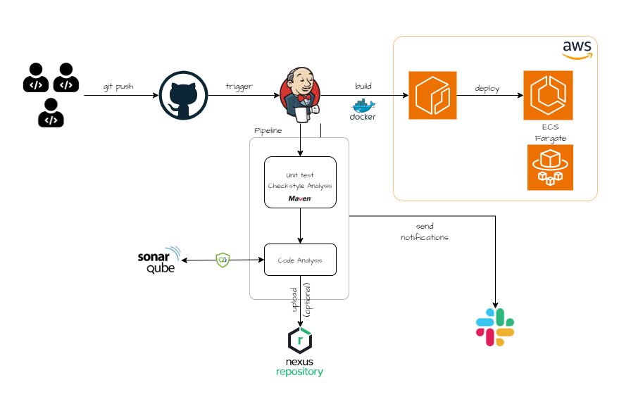

# CICD with Jenkins
> Disclaimer: I got the idea of this project while studying Imran Teli's course and reading some blogs. The application source code(Java Application) is originally from Imran, in order to focus on the construction of CI/CD pipeline rather than on coding application from scratch.

In this project, we will construct a CI/CD pipeline with Jenkins, to deploy a Java app on AWS ECS. The pipeline will be triggered on every push to the main branch of the git repository, which subsequently builds a docker image, pushes it to AWS ECR, and deploys the new image to ECS. 

## Architecture

 

## Prerequisites
1. An AWS account 
2. Basic knowledge of containerization 
3. Familiarity with scripting/programming
4. Terraform (optional)

## Technologies 
- Java Spring
- Terraform
- Maven
- Jenkins
- SonarQube
- Nexus
- Git
- Docker
- ECR
- ECS

## Project Structure 
- `setup.md`: How to set up the project
- `/terraform`: Terraform files 
- `/Jenkins-test-codes`: Pipeline integration codes
- `/userdata`: User data for EC2 instances

If you face any issues whilst performing this project, feel free to contact via: mtkforstudy.john86@gmail.com. 

